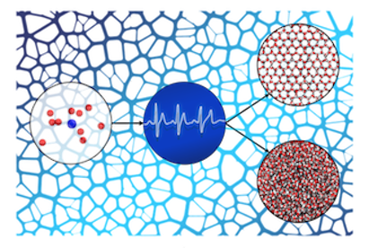

# DeepIce
#### Deep Neural Network for identifying the phase of molecules 


## Architecture of DeepIce: 

Four sub-networks combined to produce a powerful predictor

 - `Catersian Coordinates Network`
  - `Spherical Coordinates Network`
 - `Spherical Harmonics Network`
 - `Fourier Transform Network`


```
@article{deepice,
   author = {Fulford, Maxwell and Salvalaglio, Matteo and Molteni, Carla},
   title = {DeepIce: a Deep Neural Network Approach to Identify Ice and Water Molecules},
   journal = {Journal of Chemical Information and Modeling},
   doi = {10.1021/acs.jcim.9b00005}}
```


 
 ### Usage:
 
 ```
 python main_deepIce.py --help
```

Training with 10 nearest neighbours, batch size of 30 and 5 epochs:

```
python main_deepIce.py --Train --nearest_neighbours 10 --batch_size 30 --n_epochs 5 --weights_file 'models/deepice_nn10.h5' --data 'data/deepice_traindata.npz' --output_weights 'models/deepice_nn10_trained.h5
```

Predicting on a simulation slab with 5760 molecules

```
python main_deepIce.py --Predict --data_file 'simulation_data.npz' --nearest_neighbours 10 --num_mols 5760
```

Evaluating accuracy on data set:

```
python main_deepIce.py --Evaluate --data_file 'data/deepice_testdata.npz' --nearest_neighbours 13
```

##

### Classification error DeepIce compared with existing approaches:

